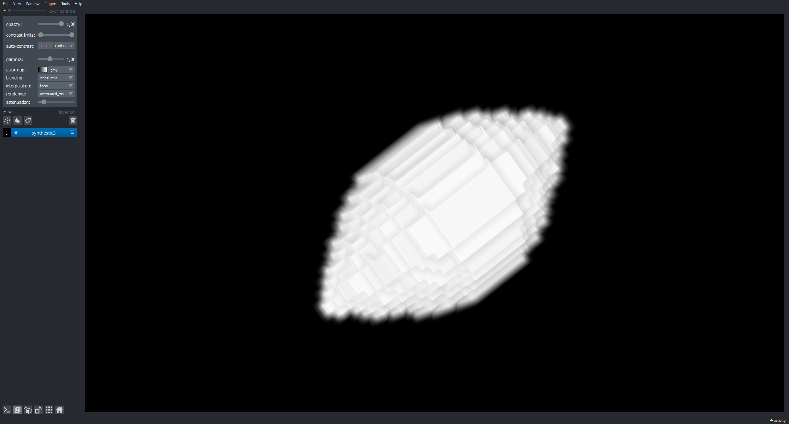
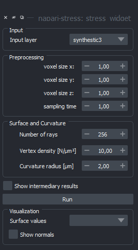
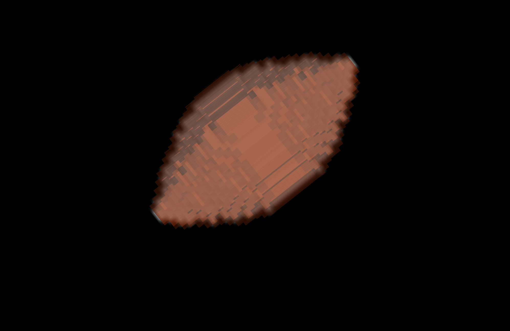
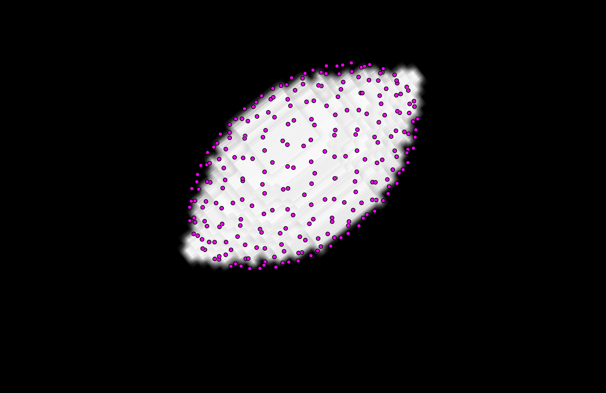
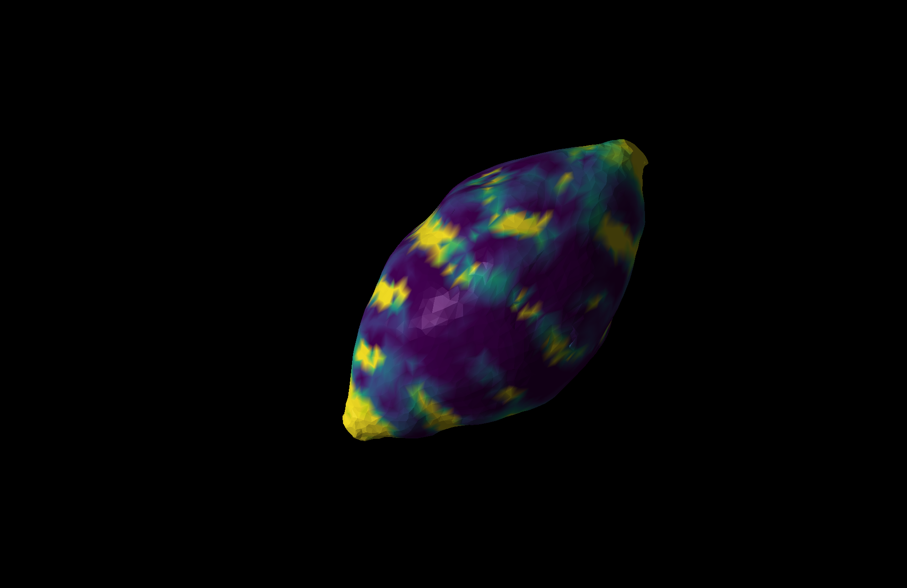
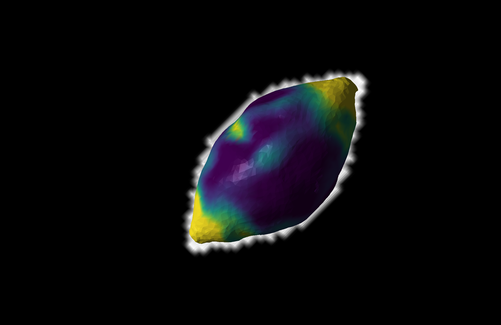
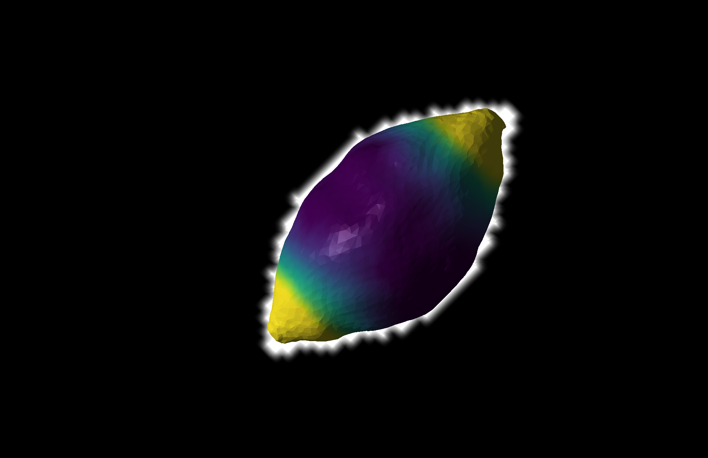

# STRESS

This plugin allows to segment fluorescence-labelled droplets , determine the surface with a ray-casting approach and calculate the surface curvatures.

## Installation

To install the plugin, clone the repository and install it:

```
git clone https://github.com/BiAPoL/napari-stress.git
cd napari-stress
pip install -e .
```

## Usage
Napari-stress is intended to work for 3D and 3D+t datasets in `[TZYX]` or `[ZYX]` format. This is an example of napari-stress on an synthetic, ellipsoidal input image (3D):



1. Open the Napari-stress widget from the Plugins menu (`Plugins > napari-stress: stress_widget`):



Input parameters:
#### Input
* Input layer: Image layer in Napari viewer on which Stress should operate. *Note*: You may have to close and re-open the plugin if the image layer is not shown in the dropdown menu.
#### Preprocessing
* voxel size x/y/z: Use this set of inputs to rescale your data to isotropic voxel sizes if this is not already the case.
* Sampling time: This is the time between to timeframes (e.g., theinverse of the sampling frequency)

#### Surface and curvature
* Number of rays: In a first step, the image is masked and a specified number of rays are cast from the center of mass towards all directions. The voxel intensities are measured along the way to find the object's surface.
  - More rays: Higher computation expense, better surface approximation
  - Less rays: Fast computation, coarse surface approximation
* Vertex density: After the initial tracing, a surface is reconstructed from the determined points and afterwards interpolated. The set voxel density determines how many vertices the surface will have. Again, using high values results in higher computational expense but better approximation.
* Curvature radius: In the last step, the surface's local curvature is measured. For this, patches of neighboring points are extraced around every vertex and the curvature is calculated. The curvature radius determines how many points will be taken into account for this.

* Show intermediary results:  If this is checked, then the results of the masking and tracing steps are displayed. Otherwise, only the recovered surface will be shown:

 

The resulting surface will look like this:

|Low curvature radius (r=2.5)| Medium curvature radius (r =5) | Higher curvature radius (r=10) |
|---|---|---|
||||


