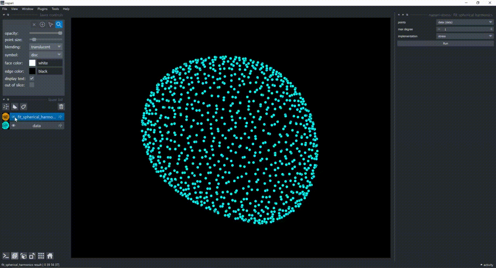
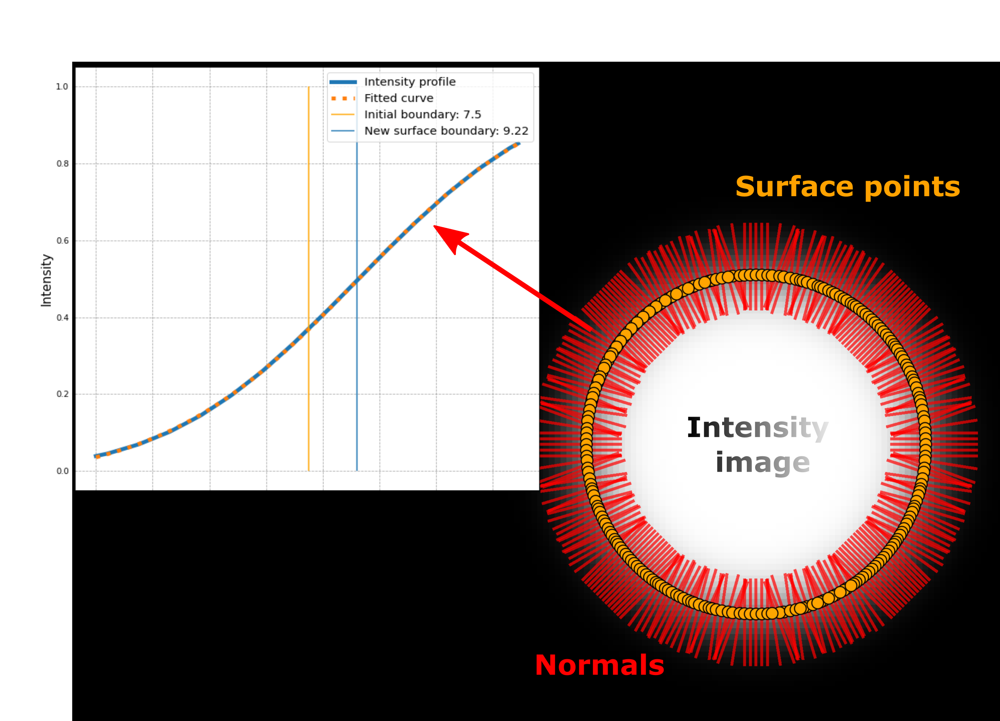
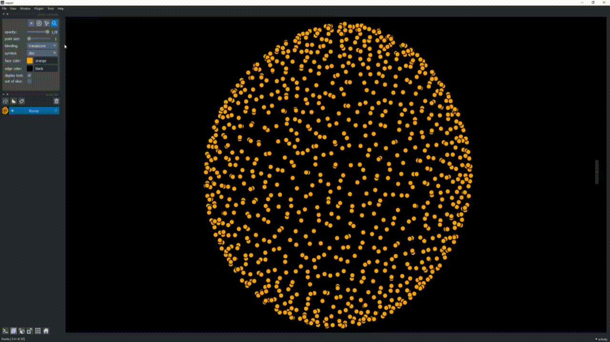
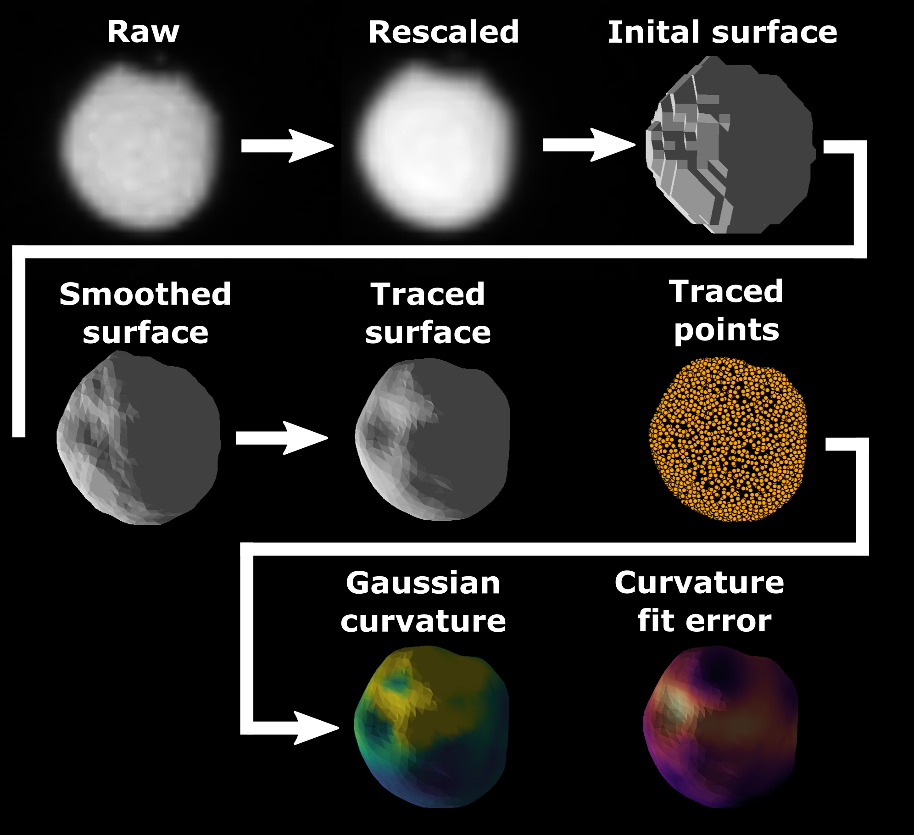

[](https://github.com/BiAPoL/napari-stress/actions/workflows/test_and_deploy.yml)
[](https://codecov.io/gh/BiAPoL/napari-stress)

# napari-stress

This plugin provides tools for the analysis of surfaces in Napari, such as utilities to determine and refine the surface-representation of objects using a ray-casting approach and calculate the curvature of surfaces. It re-implements code in Napari that was written for [Gross et al. (2021): STRESS, an automated geometrical characterization of deformable particles for in vivo measurements of cell and tissue mechanical stresses](https://www.biorxiv.org/content/10.1101/2021.03.26.437148v1) and has been made open source in [this repository](https://github.com/campaslab/STRESS).




## Usage

Functionality in this repository is divided in two groups: **Recipes** and **plugins**.

### Plugins

All functions in this repository are documented separately for [interactive usage from the napari viewer](./docs/tutorials/point_and_click) as well as [Jupyter notebooks](./docs/tutorials/demo). 

|Function| Links |
| --- | --- |
| |Fit spherical harmonics: [Interactive](./docs/tutorials/point_and_click/demo_spherical_harmonics.md) [Code](./docs/tutorials/demo/demo_spherical_harmonics.ipynb) |
| |Surface tracing: [Code](./docs/tutorials/demo/demo_surface_tracing.ipynb) |
||Reconstruct surface: [Code](./docs/tutorials/demo/demo_surface_reconstruction.ipynb)|

### Recipes

Napari-stress provides jupyter notebooks with [complete workflows](./docs/notebooks/recipes) for different types of input data and objectives. Napari-stress currently provides notebooks for the following data/image types:

* 
| Processing scheme | Description |
| --- | --- |
|| **Confocal data** (*.tif*), 3D+t:  [Jupyter notebook](./docs/tutorials/recipes/Process_confocal.ipynb) for processing single channel data and extracting gaussian curvature.|
|  | **Confocal data** (*.tif*), 3D+t: [Interactive tutorial](./docs/tutorials/recipes/Image_to_surface.md) on how to extract surfaces from intensity image data |

### Utilities

Data to be used for this plugin is typically of the form `[TZYX]` (e.g., 3D + time). Napari-stress offers convenient ways to use functions from other repositories (which are often made for 3D data) on timelapse data with the `frame_by_frame` function and the `TimelapseConverter` class. Both are described in more detail in [this notebook](https://github.com/BiAPoL/napari-stress/blob/main/docs/notebooks/demo/demo_timelapse_processing.ipynb).

## Installation

Create a new conda environment with

```
conda create -n napari-stress Python=3.9
conda activate napari-stress
```

Install a few necessary plugins:

```
conda install -c conda-forge napari jupyterlab
```

To install the plugin, clone the repository and install it:

```
git clone https://github.com/BiAPoL/napari-stress.git
cd napari-stress
pip install -e .
```

## Issues

To report bugs, request new features or get in touch, please [open an issue](https://github.com/BiAPoL/napari-stress/issues) or tag `@EL_Pollo_Diablo` on [image.sc](https://forum.image.sc/).


