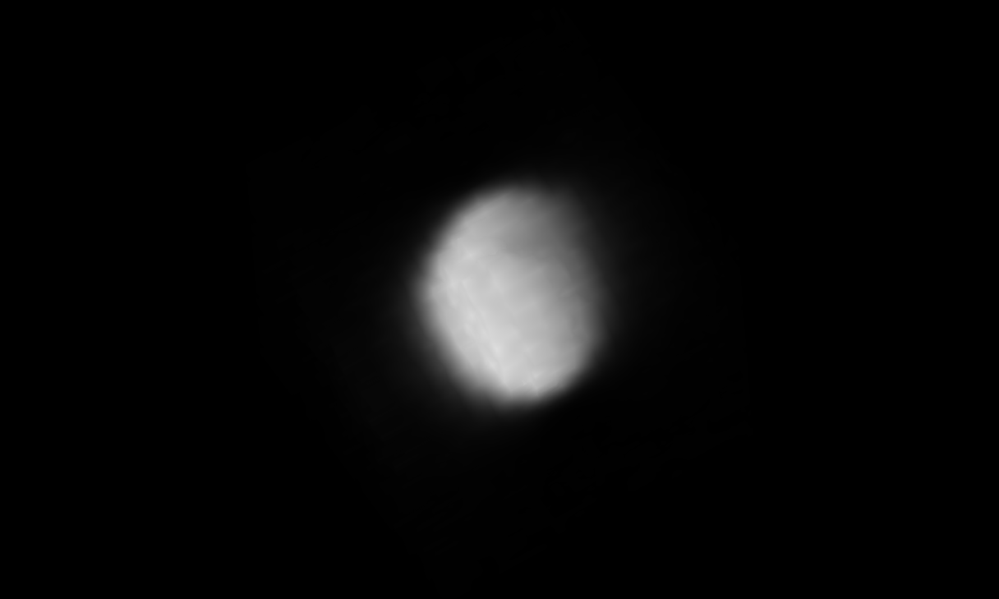

# napari-stress

This plugin allows to segment fluorescence-labelled droplets , determine the surface with a ray-casting approach and calculate the surface curvatures. It re-implements code in Napari that was written for [Gross et al. (2021): STRESS, an automated geometrical characterization of deformable particles for in vivo measurements of cell and tissue mechanical stresses](https://www.biorxiv.org/content/10.1101/2021.03.26.437148v1) and has been made public in [this repository](https://www.biorxiv.org/content/10.1101/2021.03.26.437148v1).

## Installation

Create a new conda environment with

```
conda create -n napari-stress Python=3.9
conda activate napari stress
```

Install necessary plugins:

```
conda install -c conda-forge napari jupyterlab
```

To install the plugin, clone the repository and install it:

```
git clone https://github.com/BiAPoL/napari-stress.git
cd napari-stress
pip install -e .
```

## Usage
Napari-stress is intended to work for 3D+t datasets in `[TZYX]` format. This is an example of input data from a confocal microscope (taken from [here](https://github.com/campaslab/STRESS/blob/main/ExampleTifSequence-InteriorLabel-vsx_2.076um-vsz_3.998um-TimeInterval_3.00min-21timesteps.tif):



In order to use napari-stress for your data type, please refer to the [notebooks](`./docs/notebooks/`) section. To run the notebook, open jupyter-lab in your activated environment with the `jupyter-lab` command and open the respective notebook (indicated by the `ipynb` file ending).

* Confical data (*.tif*), 3D+t: This type of data can be processed with napari-stressed as shown in [this notebook](https://github.com/BiAPoL/napari-stress/blob/split-up-main-widget/docs/notebooks/Process_confocal.ipynb)
* Lightsheet data (*.czi*), 3D + t: coming soon....
