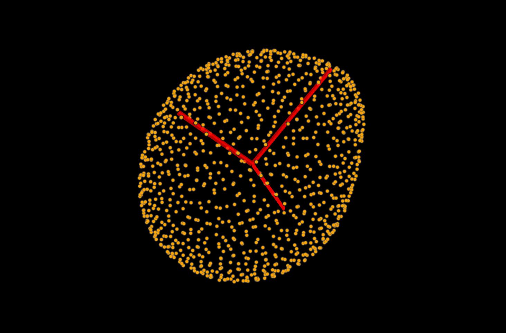
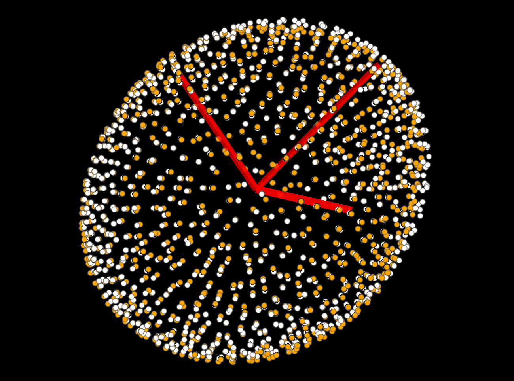

(glossary:ellipse_fitting:interactive)=
(point_and_click:fit_ellipsoid:least_squares)=
# Ellipse fitting

This tutorial shows how to handle ellipse-fitting in napari-stress. It covers the following functionality:

* [Finding the major/minor axes of an ellipsoid](fit_ellipsoid:major_minor_axes)
* [Measuring mean curvature on ellipsoid](fit_ellipsoid:mean_curvature)
* [Finding normals on ellipsoid](fit_ellipsoid:normal_vectors)

To get started, create a pointcloud according to the workflow suggestions in this repository or load the sample data from napari-stress (`File > Open Sample > napari-stress: Dropplet pointcloud`).

(fit_ellipsoid:major_minor_axes)=
## Finding the major and minor axes

**Napari-stress**

This section describes the implementation taken from the [stress repository](https://github.com/campaslab/STRESS). It provides a least-squares approach to obtain an ellipsoid which is represented by its major axes. A pointcloud can be obtained by combining the input points and the ellipsoid object. First, fit an ellipse by selecting `Tools > Points > Fit ellipsoid to pointcloud (n-STRESS)` and click on `Run`. The resulting image should look like this:

If you want to retrieve a pointcloud on the surface of the fitted ellipsoid, you can calculate the corresponding point locations of the input pointcloud on the surface of the fitted ellipsoid with `Tools > Points > Points > Expand point locations on ellipsoid (n-STRESS)`:

**Vedo**
This section describes the implementation taken from the [vedo repository](https://vedo.embl.es/). It uses a [pca-algorithm](https://en.wikipedia.org/wiki/Principal_component_analysis) to calculate the minor/major axes. Use it via `Tools > Points > Points > Fit ellipsoid to pointcloud (vedo, n-STRESS)`. As an additional parameter, it requires you to set which percentage of the input points should be contained by the surface of the fitted ellipse, which is controlled by the `inside fraction` parameter. 

Similar to the napari-stress implementation, this returns a vectors layer:

Again, you can use the expansion widget (`Tools > Points > Points > Expand point locations on ellipsoid (n-STRESS)`) to create a pointcloud from this:

(fit_ellipsoid:mean_curvature)=
## Mean curvature

Lastly, you can measure mean curvature on the surface of this ellipse. To do so, use the `Tools > Measurement > Mean curvature on ellipsoid (n-STRESS)` plugin from the tools menu. As input, you should select the fitted ellipsoid as well as a set of points on the surface of the ellipsoid. You can use the previously obtained points (`Expand point locations on ellipsoid (n-STRESS)`) as input. The result will be the following:

You can also use [napari-matplotlib](https://napari-matplotlib.github.io/index.html) [feature visualization widget](point_and_click:visualize_features) to show, for instance, a hiostogram of the curvature on the surface.

(fit_ellipsoid:normal_vectors)=
## Distances between pointcloud and approximation

You can calculate how well the ellipsoid approximates the pointcloud by calculating the pairwise distances between the input points and the approximated points. To do so, use the `Tools > Points > Calculate pairwise distance vectors (n-STRESS)` plugin from the tools menu. As input, you should select the originl and the approximated pointclouds. The result will be the following:

Measureing the lengths of these vectors will soon be possible.