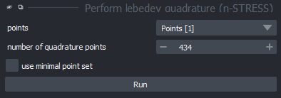
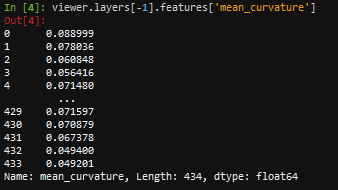

(glossary:measure_curvature:interactive)=
# Measure curvature

This tutorial explains how to measure [curvature](spherical_harmonics:measurements:mean_curvature) from a sperhical harmonics expansion. To do so, first create a spherical harmonics expansion as shown in [this section](glossary:spherical_harmonics). To get the curvature from this you'll then have to perform a lebedev quadrature and then measure curvature.

## Lebedev quadrature

A lebedev quadrature determines points on the surface of a sperhical harmonics expansion that allow to calculate downstream parameters with high accuracy. To do so, chose the appropriate command from the napari tools menu (`Tools > Points > Perform lebedev quadrature (n-STRESS)` and select the layer with the expansion data from the drowdown:

## Measure curvature

Next, you can already measure the mean curvature on this surface with `Tools > Measurement > Measure mean curvature on manifold (n-STRESS)"`. Make sure to select the previously generated layer that contains the Lebedev quadrature points in the dropdown:

The results are then stored in the `layer.features`. In case the curvature values should not be displayed as colors on the pointcloud,  you can retrieve the values from the napari console by clicking the `>_` icon on the bottom left and typying the following command: `viewer.layers[-1].features['mean_curvature']`

Type  to retrieve specifically the curvature values.
