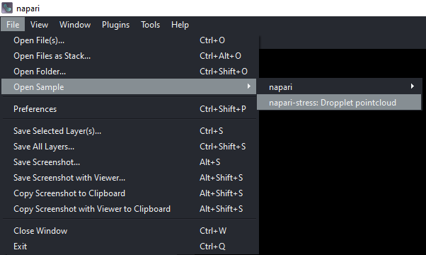
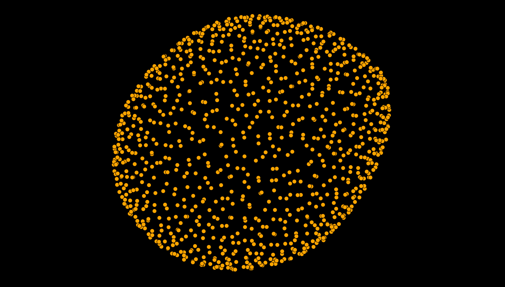

(point_and_click:visualize_features)=
(utility:visualize_features)=
# Visualize measurements

Napari-stress offers functionality to visualize measured data interactively in the napari viewer. This tutorial provides guidance on how to use these. 

* [Visualizing features](#visualize-features)
* [Export data](#export-data)

## Sample data

To get started, create a pointcloud according to the workflow suggestions in this repository or load the sample data from napari-stress (`File > Open Sample > napari-stress: Droplet pointcloud`).

 

Create a spherical harmonics expansion with `Tools > Points > Fit spherical harmonics (n-STRESS)`:

## Visualize features 

`Features` in the napari ecosystem are measurements that are assigned to a single Point (`Points` layer), label (`Labels` layer), or Surface vertex (`Surface` layer). In the context of napari-stress, such measurements include point-wise spherical harmonics expansion errors, curvature, etc. To do so for the created sample data, open the widget for this from `Tools > Utilities > Visualize pointcloud features (n-Stress)`.

In the dropdown labelled `x axis key`, you'll see all available measurements for the selected layer - in this case, the feature to be visualized is called `error` and corresponds to the fit residue of the spherical harmonics expansion. By changing the number of bins (`n bins`) and clicking on `Update` you can change the number of bins of the histogram and apply the changes:

You can additionally show the [cumulative distribution function ](https://en.wikipedia.org/wiki/Cumulative_distribution_function) (CDF) by clicking on the `CDF` button:

Lastly, to explore the histogram/CDF distributions interactively, you can select parts of the histogram by drawing a rectangular selection on the plot:

Note that the points pertaining to features in the respective range are highlighted in the viewer. You can also change the range of the selection by using the `Upper percentile` and `Lower percentile` spinboxes.

To plot a different feature, select it from the dropdown and click `Update` to apply.

## Export data 

Lastly, you can export the displayed (histogram) data as a `.csv` file using the `Export plot as csv` button.