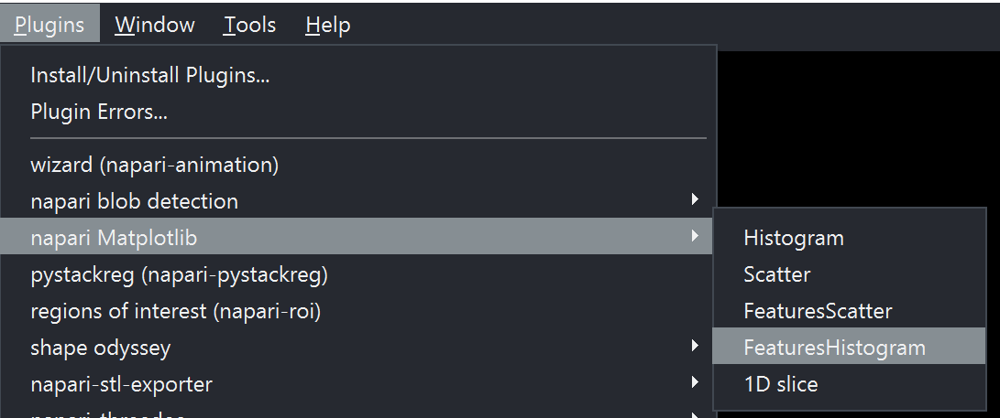
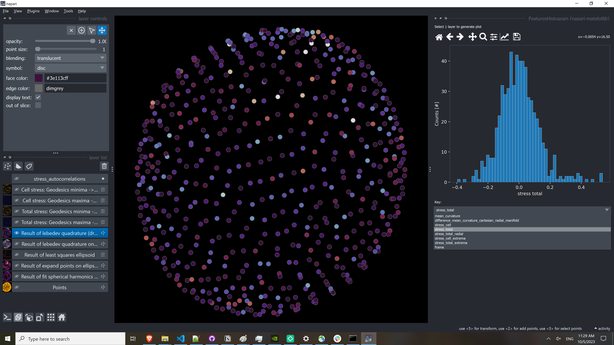

(point_and_click:visualize_features)=
# Visualize measurements

Napari-stress (and the [measurement toolbox](toolboxes:stress_toolbox:stress_toolbox_interactive), in partciular) generate a number of measurements that can be visualized using the [napari-matplotlib](https://napari-matplotlib.github.io/) plugin. It is automatically installed with napari-stress and can be activated from the plugins menu (`Plugins > napari Matplotlib`).

In order to use it, check out the documentation on the [napari-matplotlib page](https://napari-matplotlib.github.io/). In the scope of napari-stress, what you will need, is the Features Histogram (`Plugins > napari Matplotlib > FeaturesHistogram`).

To display measurements, select a layer of interest and the dropdown in the newly created Histogram widget will show all possible features for you to highlight.

