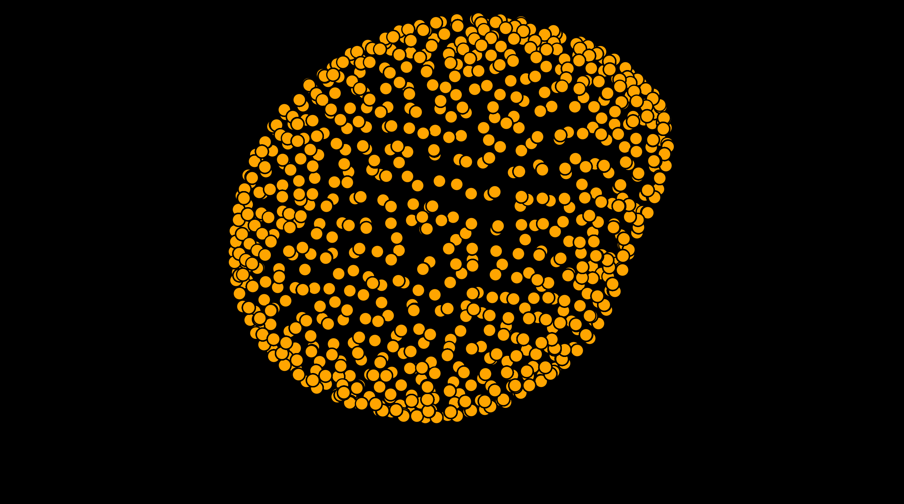
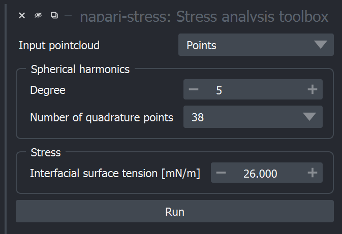
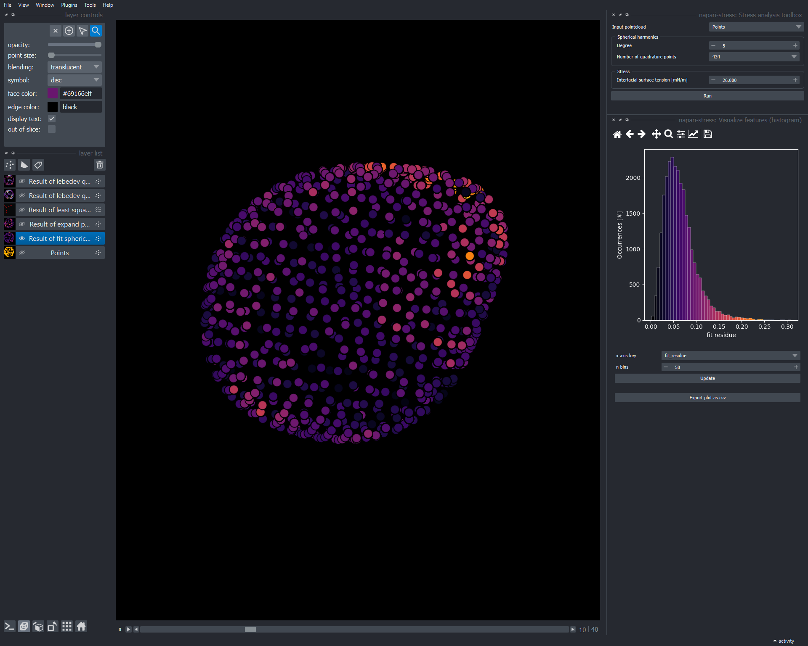
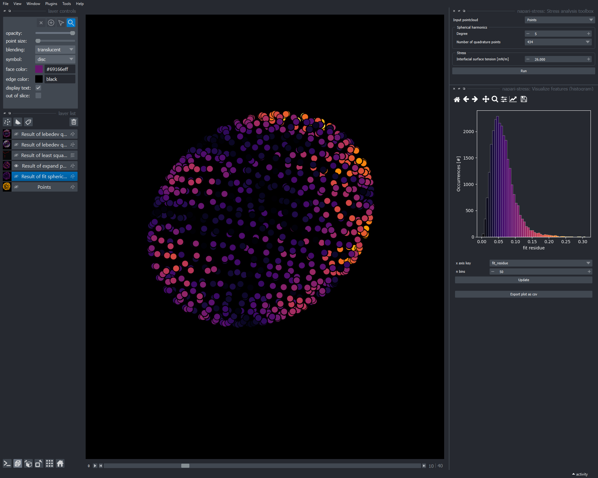
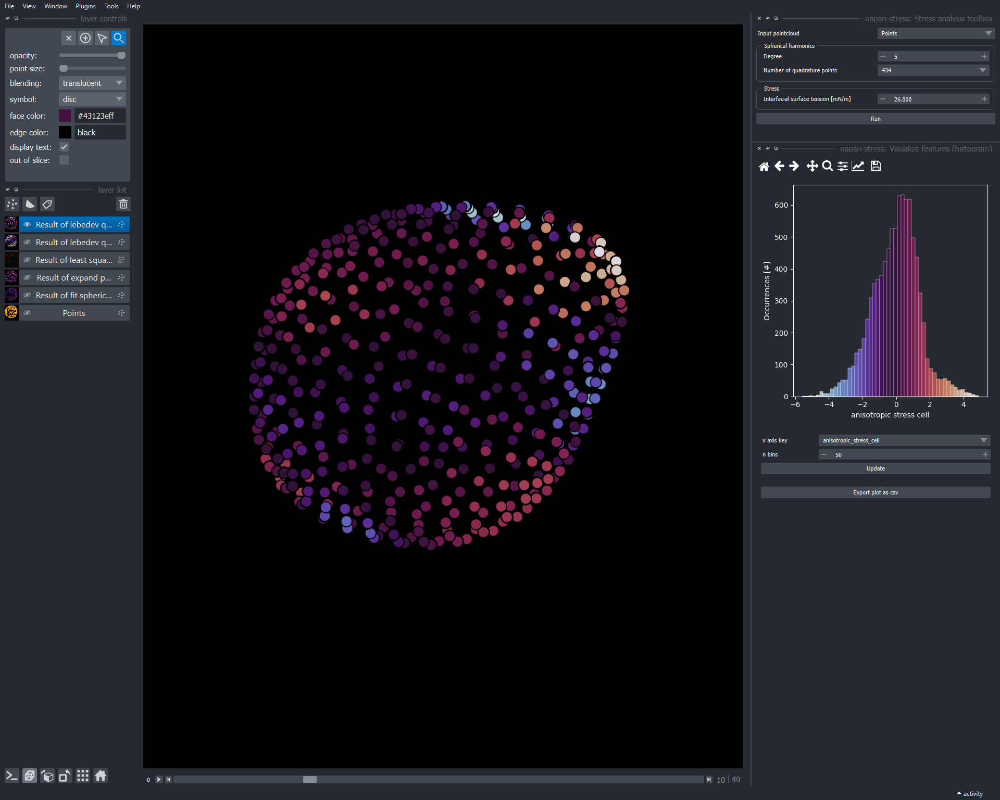
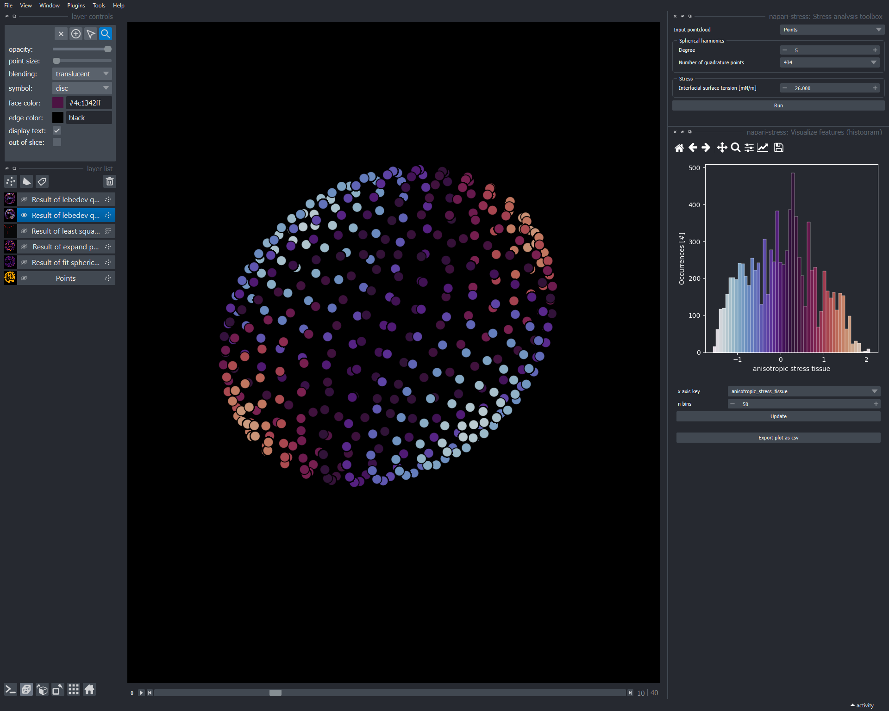

(point_and_click.stress_toolbox)=
(toolboxes:stress_toolbox:stress_toolbox_interactive)=
# Comprehensive stress analysis

To provide a means for easy, comprehensive analysis of reconstructed droplet data, napari-stress provides the `stress analysis toolbox`. As example data, you can use the 4D example dataset of a reconstructed pointcloud (`File > Open Sample > napari-stress > 4d Droplet pointcloud`):

## The stress toolbox

Open the stress toolbox from the plugins menu (`Tools > Measurement > Measure stresses on droplet pointcloud (n-STRESS)`):

The settings require the following input:

* `Input pointcloud`: Layer of a reconstructed droplet. Can be 3D or 4D.
* `Degree`: Degree of the spherical harmonics expansion fitted to the pointcloud. The higher the degree, the better the fit. For mor details, see [glossary](spherical_harmonics:mathematical_basics:degree).
* `Number of quadrature points`: Number of points on which curvature will be evaluated.

    *Note 1*: High values (>1000) can lead to signiicant computational expense on first time run.

    *Note 2*: Using high-order spherical harmonics requires a specific minimal number of quadrature points. The number of quadrature points can be higher than this number, but not lower.

* `Interfacial surface tension [mN/m]`: Surface tension in mN/m of the evaluated droplet.

## Analyzing the output

The toolbox creates a number of layers when finished, some with attached features that can be displayed using the [feature visualization utilities](point_and_click:visualize_features) from napari-stress. These include:

* `Result of fit spherical harmonics`: Result of the spherical harmonics expansion. Contains the `fit_residues` feature which denotes the residual distances between the raw points and the input points.

* `Result of expand points on ellipsoid`: Result of the [least-squares ellipsoidal](point_and_click:fit_ellipsoid:least_squares) fit. Contains the `fit_residues` feature which denotes the residual distances between the raw points and the input points.

* `Result of least squares ellipsoid`: Vectors layer that visualizes the major axes of the fitted ellipsoid.

* `Result of lebedev quadrature (droplet)`: Result of the lebedev quadrature point determination. Contains the `mean_curvature` ($H_i$), `anisotropic_stress_cell` ($\sigma^A_C$) and `anisotropic_stress` ($\sigma^A$) features.

* `Result of lebedev quadrature on ellipsoid`: Result of evaluating the determined quadrature points on the corresponding locations on surface of the previously determined least-squares ellipsoid. Contains the feature `anisotropic_stress_tissue`

