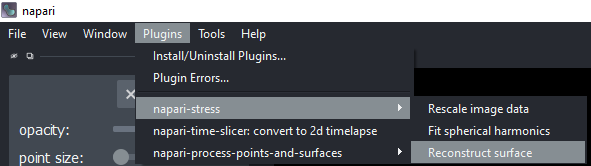
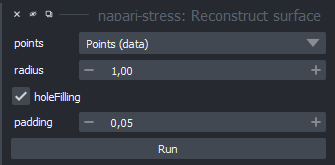
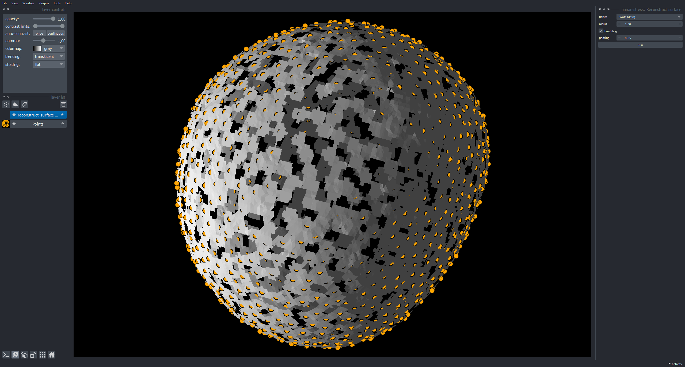
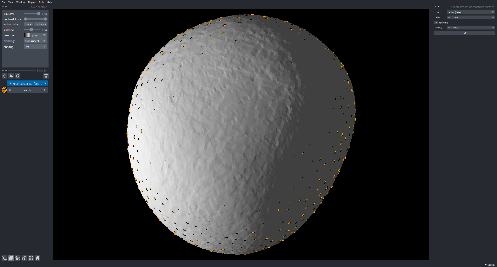

(glossary:surface_reconstruction:interactive)=
# Surface reconstruction

This tutorial will explain how to perform a surface reconstruction with napari-stress interactively from the napari viewer. This plugin implements the [respective function](https://vedo.embl.es/autodocs/content/vedo/pointcloud.html#vedo.pointcloud.Points.reconstructSurface) from the [vedo](https://vedo.embl.es) library. To get started, open your own data or use the provided sample data from napari-stress ([raw data source](https://github.com/campaslab/STRESS)):

Select the `Reconstruct surface` function from the plugin menu:

This will bring up the plugin widget:

## Results

The `radius` controls the search radius of the algorithm: To reconstruct a surface, the function finds all neighboring points for a given point in the pointcloud to be considered for a surface. Setting this value too low will result in a leaky surface:

In creasing the value will fix this issue:

Such surfaces typically consist of a large ammount of vertices. This behaviour can be control with the `padding` parameter: Increasing it will simplify the obtained surface representation:

If you are interested in doing this from code, check out this [example notebook](glossary:surface_reconstruction:code)=
