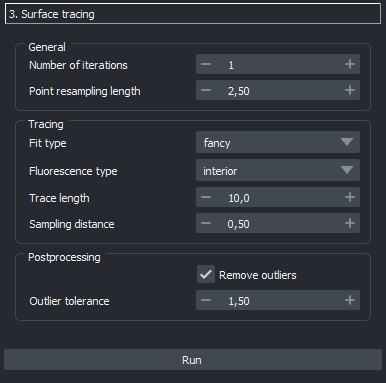
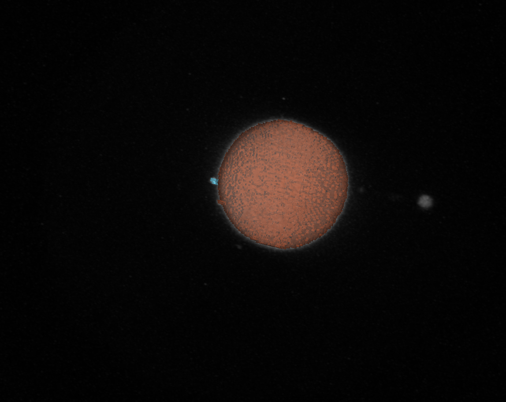
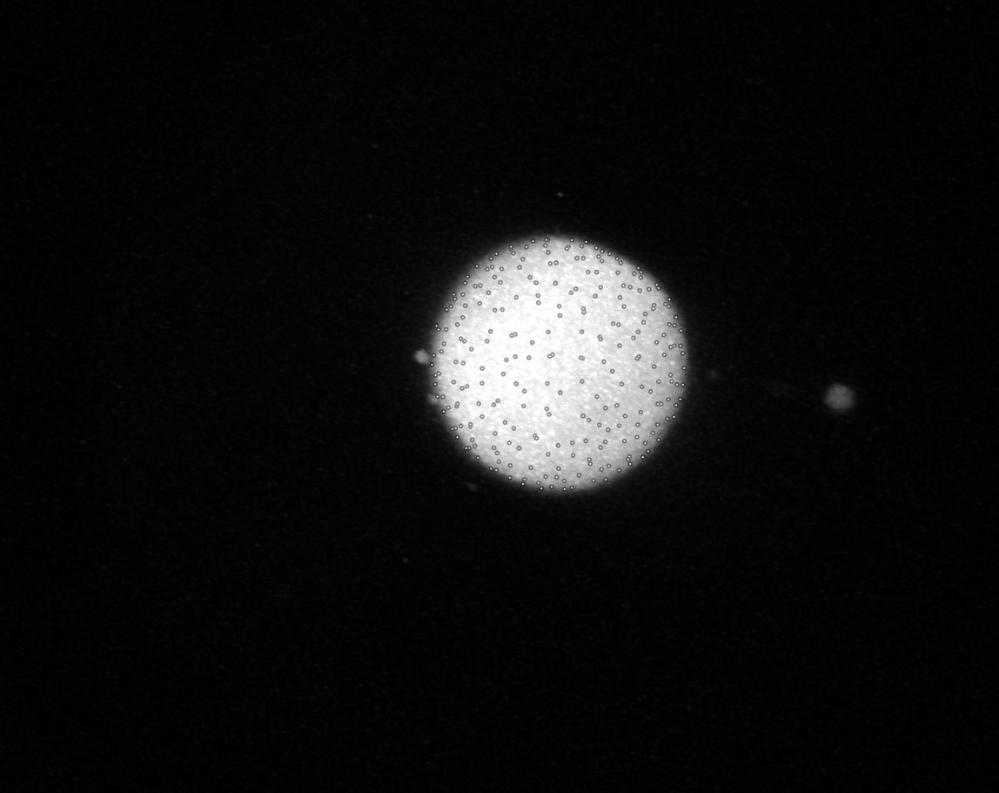
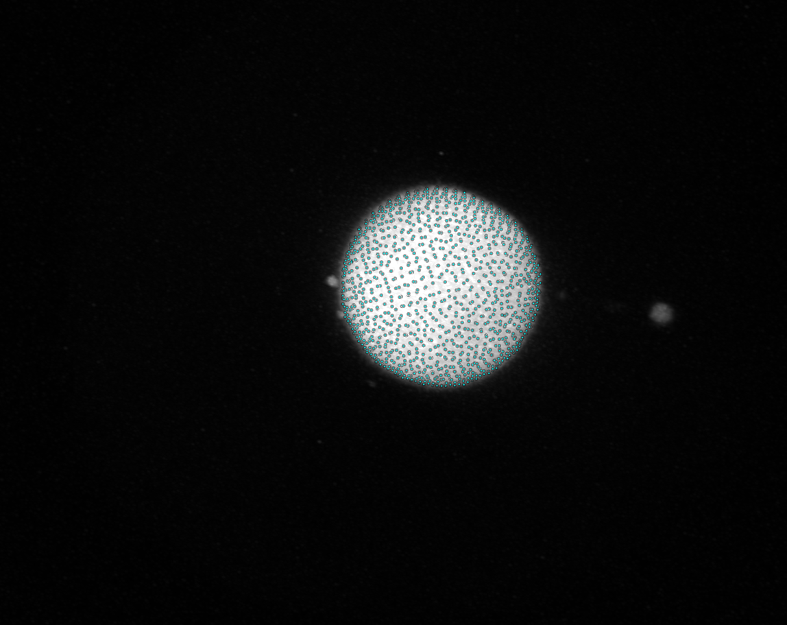
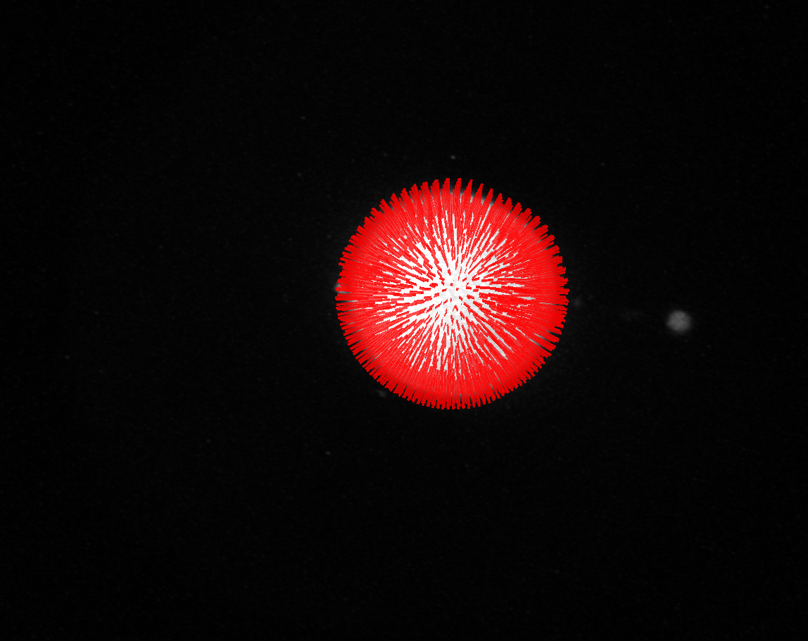

(toolboxes:droplet_reconstruction:interactive)=
# Droplet reconstruction toolbox

In order to save you the trouble of walking through each of the steps manually for the reconstruction of oil droplets, napari-stress provides you the droplet reconstruction toolbox (`Tools > Surfaces > Droplet reconstruction toolbox`). Let's go through the princiiipal steps of the reconstruction:

## Principal steps
The principal steps of the reconstruction procedure and the relevant settings are:

**Preprocessing**

* Rescaling: Making data isotropic. The principal choice here is, to which voxel size the data should be rescaled to. The fields `Voxel size [x,y,z]` denote the *current* voxel sizes of the data and the `Target voxel size` refers to the voxel size you'd like the data to have. The lower you set the latter, the slower the process will be.

**Initial reconstruction**

* `Image smoothing sigma`: Before proceeding to obtain a first segmented estimate for the outline of the droplet, it is typically processed with a gaussian blur. You can set the strength of this blur with this parameter.
* `Smoothing iterations`: To avoid voxel-artifacts, the surface is smoothed with the [using the vedo library](https://vedo.embl.es/docs/vedo/mesh.html#Mesh.smooth). The more iterations you perform, the smoother the surface will be.
* `Initial number of points`: The [vedo subsample method](https://vedo.embl.es/docs/vedo/pointcloud.html#Points.subsample) is used to extract a set of points on the surface as a first guess at the reconstructed droplets from the smoothed surface. The initially sampled points are shown after the toolbox has finished, so if you find the points too few, you can increase this number.

**Refinement**

The refinement of the first selection of points consists of two principal steps and is performed several times - the number of iterations can be controlled with the `number of iterations` parameter:

In each iteration, the following steps are done:
* Resampling: The cartesian coordinates of the points are interpolated according to latitude and longitude. The resampled points are drawn according to a fibonacci-scheme. You can control the number of points that are sampled with the following parameters:
    * `Point resampling length` field: The larger this value is, the more scarce the points will be on the surface.
    * `Number of iterations`: The larger this value is, the more times the entire procedure in this step is repeated. The more iterations you perform, the longer the processing will take.
* Trace-refinement: Normals are cast outwards from the sample point and the intesity in the rescaled image along the vectors is mmeasured. The surface point is then moved along this line to best fit the intensity distribution. For more details, see [this notebook](glossary:surface_tracing:code). In short, the parameters control:
    * `Fluorescence type`: Whether the droplet is labelled on the surface or in the interior.
    * `Fit type`: Select fancy to use a sigmoid function to fit the intensity distribution. Select `quick` to use a simple detection of the half maximum intensity along the normal vector.
    * `Trace length`: The length of the normal vector along which the intensity is measured. The larger this value is, the longer the normal vector will be.
    * `Sampling distance`: The step size along the normal vector. The smaller this value is, the more points are sampled along the normal vector.
    * `Image intensity interpolation`: The image intensity is interpolated along the normal vector. The `Nearest neighbor` interpolation is the fastest, but the `Linear` interpolation is more accurate. Choose `cubic` for even more accuracy.
* Postprocessing: During the trace-refinement, the point poistions are re-fitted along the surface normals.  This fitting yields a number of parameters, according to which points can be classified as outliers.
    * `Remove outliers`: Whether or not to remove outiers.
    ``Outlier tolerance`: Defines how exactly points are declared outliers. The default setting defines a value an outlier if is above or below $1.5 \cdot IQR$, where $IQR$ denotes the [interquartile distance](https://en.wikipedia.org/wiki/Interquartile_range).

* `Parallelize with dask`: Whether or not to parallelize the processing with [dask](https://dask.org/). This is only recommended if you have a lot of cores available - it is recommended to have approximately `8GB` of RAM memory per CPU core. Checking this button will open the dask dashboard in your browser, so you can monitor the progress of the processing.

## Results
The droplet reconstruction toolbox yields a number of result layers:

* `Rescaled image`: Image layer of the raw data after rescaling to the above-set voxel size

* `Label image`: Binarized version of the droplet

* `points_first_guess`: Initially sampled points on the droplet surface

* `Refined points`: Points after trace-refinement

* ``Normals`: Normals along which the trace-refinement was conducted

## How to proceed

In order to run the stress analysis, use the `Refined points` as an input for the [stress analysis toolbox](toolboxes:stress_toolbox)
