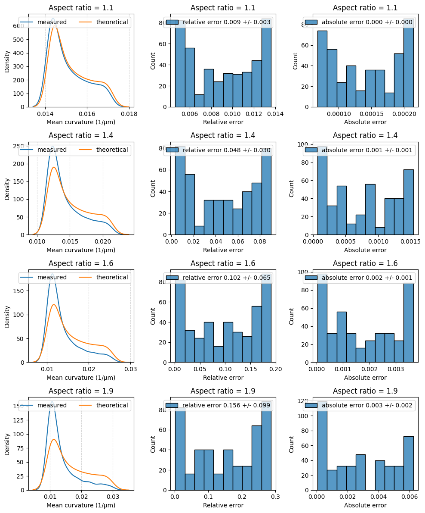
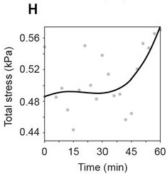
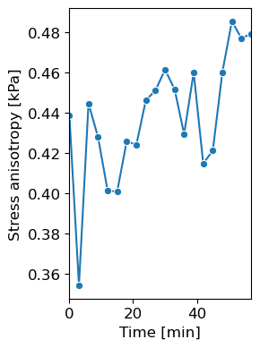
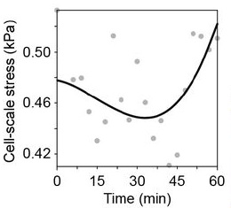
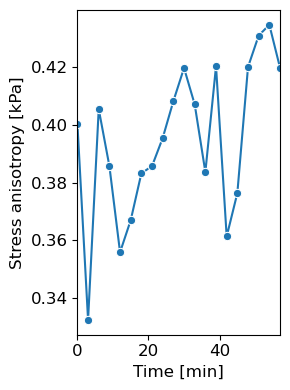
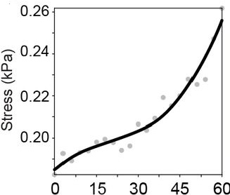
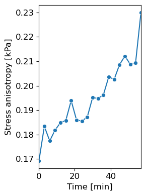
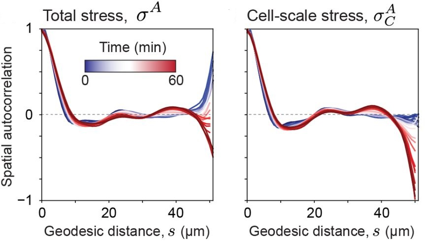
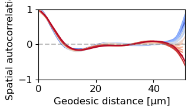
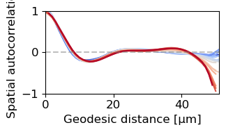

# Validation

Has napari-STRESS been validated? If so, how? To make sure that the results obtained with napari-STRESS are credible, we implemented several tests to ensure that this is the case. In general, two types of validation experiments have been conducted: Theoretical calculations on synthetic data and experimental validation on the same data, the results of the legacy STRESS implementation have been obtained from.

## Theoretical validation

The exact validation steps and procedures are summarized in [this notebook](validation:theoretical_analysis). In short, synthetical data of spherical and ellipsoidal objects have been generated and have been artifically blurred with a Gaussian kernel. We then applied the STRESS reconstruction workflow, to obtaina pointcloud and measurements for the mean curvatures. We then compared the reconstructed positions and the mean curvatures with the true position on the surface of the generated object and their respective [theoretically described](https://mathworld.wolfram.com/Ellipsoid.html) mean curvatures. This experiment was repeated for several aspect ratios.

## Practical validation

As a second validation, we reran the napari-STRESS reconstruction and analysis workflow on the same data, the legacy STRESS implementation has been run on. Key results of the legacy STRESS implementation and napari-STRESS have been compared and are shown below. Furthermore, [this notebook](validation:validation_experimental_data) provides all the views which were used in the section about napari-STRESS in the Preprint about the plugin.

| Parameter | Legacy STRESS | napari-STRESS |
| --- | --- | --- |
| Total stress |  |  |
| Cell-scale stress |  |  |
| Tissue-scale stress |  |  |
| Total stress spatial autocorrelation |  |   |