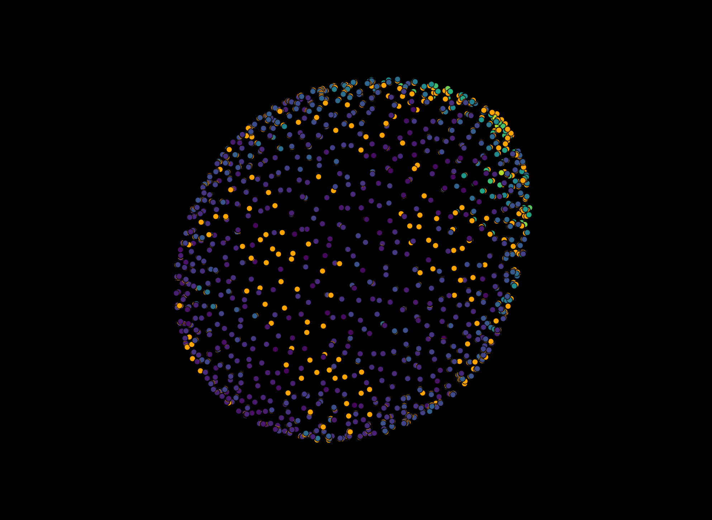

(point_and_click.spherical_harmonics_expansion)=
(glossary:spherical_harmonics:interactive)=
# Spherical harmonics expansion

This tutorial will explain how to perform a spherical harmonics surface expansion with napari-stress interactively from the napari viewer. To get started, open your own data or use the provided sample data from napari-stress ([raw data source](https://github.com/campaslab/STRESS)):


You can then approximate this pointcloud with a [](spherical_harmonics:mathematical_basics) expansion. In brief, this fits a set of basis functions to the input pointcloud and returns an analytical representation of the points on the surface. This then allows to sample any number of points on the approximated surface and derive further characteristic surface parameters.

Select the spherical harmonics expansion from the tools menu (`Tools > Points > Fit spherical harmonics (n-STRESS)`):


This will bring up a dialogue with the available options:


**Parameters**:

* `max_degree`: Controls the accuracy of the approximation (see [glossary](spherical_harmonics:measurements:fit_residue) for details). A higher-degree expansion will lead to a better approximation of the input pointcloud, but will eventually pick up noise and lead to [overfitting](https://en.wikipedia.org/wiki/Overfitting). A lower degree will lead to a smoother surface, but higher remaining errors.
* `implementation`: Which implementation to use. Currently supported backends are STRESS (*recommended*) and [pyshtools](https://shtools.github.io/SHTOOLS/).
* `expansion type`: Controls whether the points should be approximated in a cartesian (*recommended*) or radial (=spherical) coordinate system.

## Results

Applying a spherical harmonics expansion of `max_degree = 5` will lead to the following result. The colorcoding of the fitted points corresponds to the fit remainder of the spherical harmonics expansion.



Lowering the value to `max_degree = 1` will lead to only the first *mode* of spherical harmonics being used, which corresponds to fitting a sphere to the pointcloud:


**Layer display settings**

napari may default to innapropriate settings for the pointcloud (e.g., inproper point size or color). To change this, select the malformated layer, click the `select_points` icon in the top left:


Then, drag a box over all points and change the point size and face color with the slider and the color selecter, respectively. Alternatively, you can also open the code terminal with the icon in the bottom-left:


and type:

```Python
viewer.layers[-1].size = 0.5
viewer.layers[-1].face_color = 'cyan'
```
