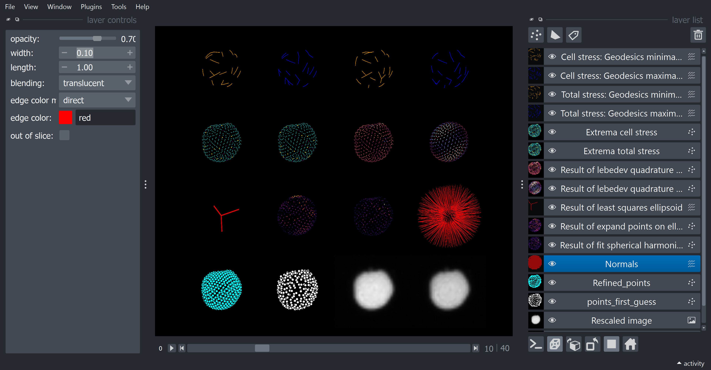

[](https://github.com/campaslab/napari-stress/raw/main/LICENSE)
[](https://pypi.org/project/napari-stress)
[](https://python.org)
[](https://github.com/campaslab/napari-stress/actions/workflows/test_and_deploy.yml)
[](https://codecov.io/gh/campaslab/napari-stress)
[](https://github.com/pre-commit/pre-commit)
[](https://pypistats.org/packages/napari-stress)
[](https://www.napari-hub.org/plugins/napari-stress)
[](https://doi.org/10.5281/zenodo.6607329)

# Introduction

Welcome to the documentation for napari-stress! This ressource provides information, links and examples to navigate and use the functionality of napari-stress, which provides the code for [Gross et al. (2021): STRESS, an automated geometrical characterization of deformable particles for in vivo measurements of cell and tissue mechanical stresses](https://www.biorxiv.org/content/10.1101/2021.03.26.437148v1).

## Contents

- [Usage from code](topic:01_code_usage): Overview about modular functions in napari-stress and how to use them from code or interactively from the napari viewer. Among others, you'll find examples for how to use toolbox functions, which bundle up many functionalities of the STRESS workflow in few lines of code. See demo notebook for [reconstruction and analysis](toolboxes:analyze_everything)

- [Interactive usage](topic:interactive_usage): If you want to do the analysis in an interactive fashion, you can do so directly in the napari viewer. Again, the provided toolboxes for [reconstruction](glossary:surface_reconstruction:interactive) and [measurement](toolboxes:stress_toolbox:stress_toolbox_interactive) should come in handy.



## Installation

To install nappari-STRESS in your environment (provided you have Python and napari already installed), simply type this in your command:

```
pip install napari-stress
```

For more detailed installation instructions,, hints and some known issues, please refer to the [installation section](FAQ:installation).

### Other useful packages

Some packages can be very helpful in conjunction with napari-STRESS, e.g., for better 3D interactivity, visualization of the results and/or data export. Here are some suggestions:

- [Napari-threedee](https://www.napari-hub.org/plugins/napari-threedee): Enhance rendering options in napari with a set of interesting tools for mesh lighting, plane rendering, etc.install type `pip install napari-threedee`.
- [Napari-matplotlib](https://www.napari-hub.org/plugins/napari-matplotlib): Visualize results obtained with napari-STRESS directly inside the napari viewer with matplotlib. To install, type `pip install napari-matplotlib`.
- [napari-aicsimageio](https://www.napari-hub.org/plugins/napari-aicsimageio): Importer library to directly load common file formats into the napari viewer via drag & drop. *Note*: Depending on the fileformat, you may have to install additional packages (see the documentation for hints on what exactly you need.) To install, type `pip install napari-aicsimageio`.

If you encounter problems during installations, please have a look at the [FAQ page](FAQ:installation).

## Acknowledgements

If you use napari-stress in your research, please check the [acknowledgements and citation section](topic:acknowledgement_citation) on further information.

## Issues

If you encounter any issues during installation, please

* browse the [FAQ section](FAQ:installation) for known issues
* file an [issue on github](https://github.com/BiAPoL/napari-stress/issues)
* check out the [image.sc forum](https://forum.image.sc/) for help (Please tag @EL_Pollo_Diablo to notify the developers)
