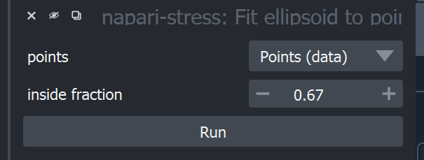
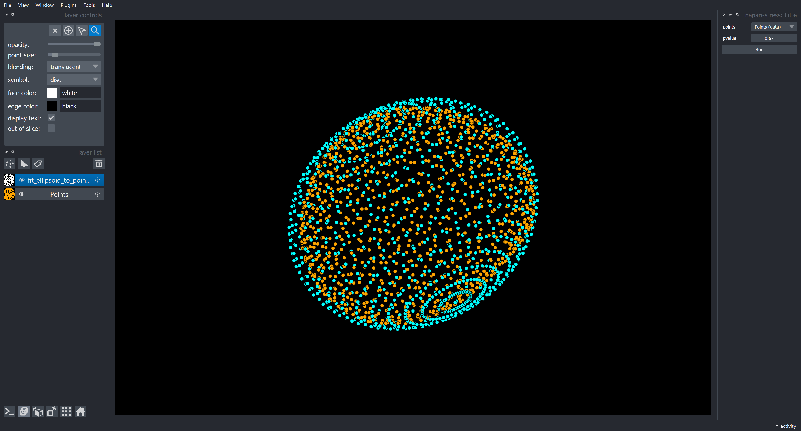
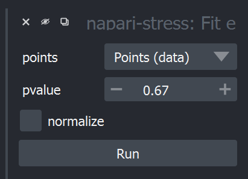

# Spherical harmonics expansion

This tutorial shows how to handle ellipse-fitting in napari-stress. To get started, create a pointcloud according to the workflow suggestions in this repository or load the sample data from napari-stress (`File > Open Sample > napari-stress: Dropplet pointcloud`).

## Ellipse-fitting: Points

The implemented function provides two separate functions. One can be used to return the ellipsoid as a pointcloud (with points on the surface of the fitted ellipsoid) and another that returns the major and minor axis of the ellipsoid as a [vectors layer](https://napari.org/howtos/layers/vectors.html) in napari.

To do the former, select the respective function from the plugins menu (`Plugins > napari-stress > Fit ellipsoid to pointcloud (points)`):

The `inside_fraction` parameter controls how many of the points of the input pointcloud will be comprised within the volume of the fitted ellipsoid. Running this widget will give this result:

## Ellipse-fitting: Vectors

Sometimes it may be of higher interest to retrieve not points on a surface, but rather other descriptive parameters of the ellipsoid, such as the major and minor axis. This can be done with the sister-plugin of the above-described function (`Plugins > napari-stress > Fit ellipsoid to pointcloud (vectors)`):

The options are the same as above, including an additional option to normalize the returned vectors to a length of 1. This returns the following output:

