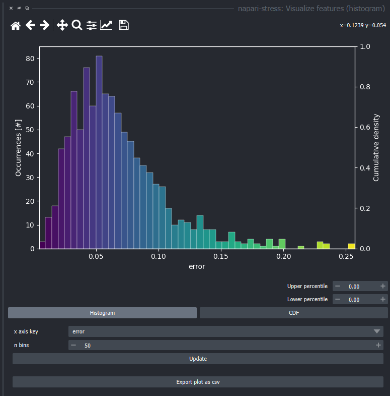
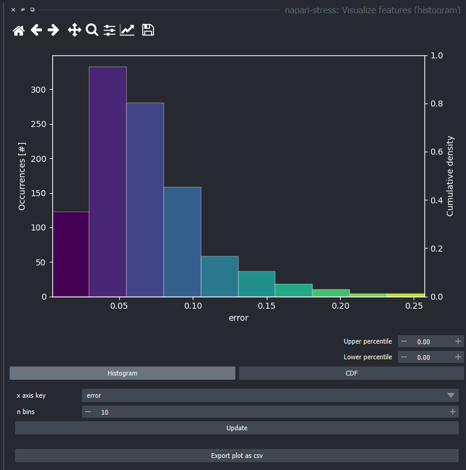

# Visualize measurements

Napari-stress offers functionality to visualize measured data interactively in the napari viewer. This tutorial provides guidance on how to use these. 

* [Visualizing features](#visualize-features)

## Sample data

To get started, create a pointcloud according to the workflow suggestions in this repository or load the sample data from napari-stress (`File > Open Sample > napari-stress: Dropplet pointcloud`).

 

Create a spherical harmonics expansion with `Tools > Points > Fit spherical harmonics (n-STRESS)`:

## Visualize features 

`Features` in the napari ecosystem are measurements that are assigned to a single Point (`Points` layer), label (`Labels` layer), or Surface vertex (`Surface` layer). In the context of napari-stress, such measurements include point-wise spherical harmonics expansion errors, curvature, etc. To do so for the created sample data, open the widget for this from `Plugins > napari-stress > Visualize features (histogram)`.

In the dropdown, you'll see all available measurements for the selected layer - in this case, the feature to be visualized (the `x axis key`) is called `error` and corresponds to the fit residue of the spherical harmonics expansion. By changing the number of bins (`n bins`) and clicking on `Update` you can change the number of bins of the histogram and apply the changes:

To plot a different feature, select it from the dropdown and click `Update` to apply.