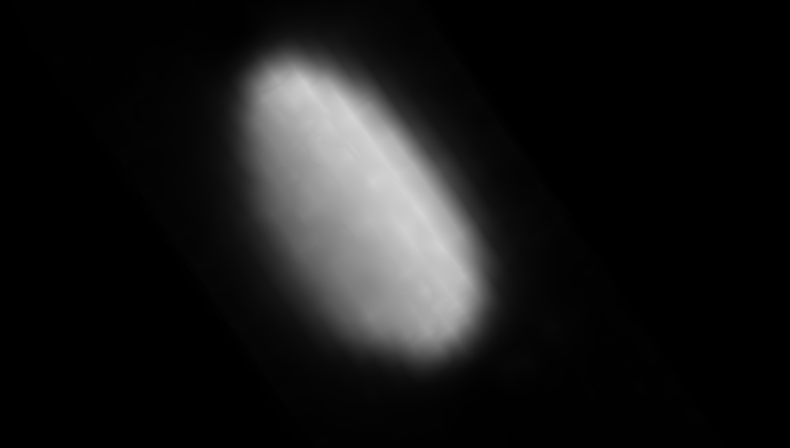
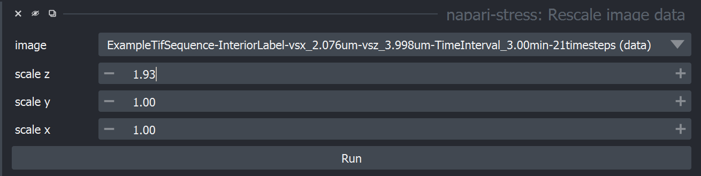
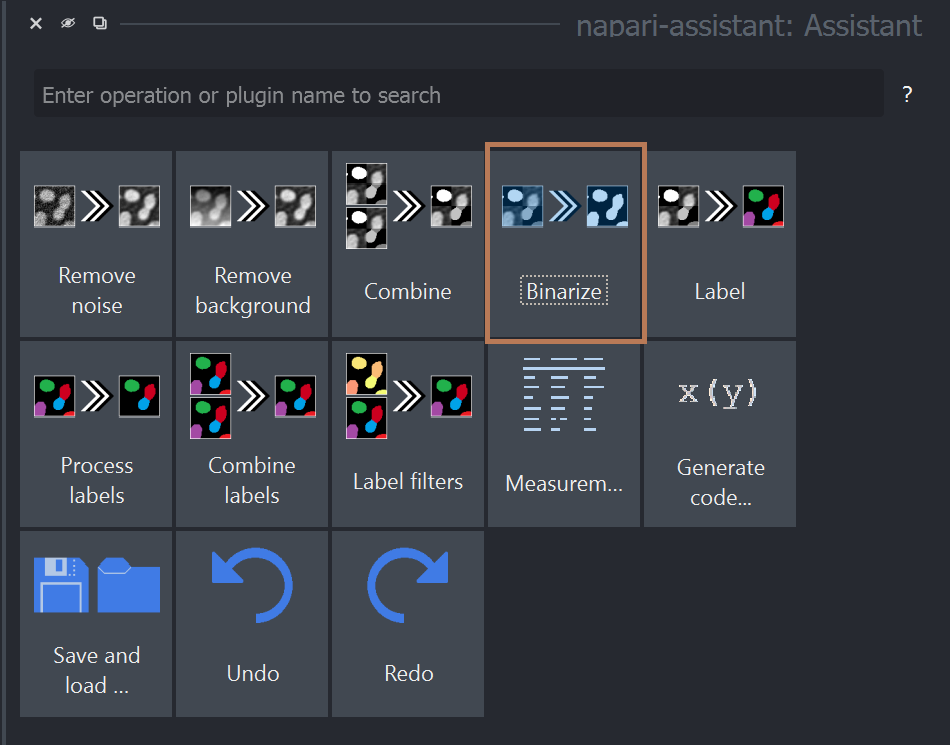

# From intensity image to surface

This tutorial will demonstrate how to convert an intensity image to a surface layer object in Napari. 

| Heterotropic image data | Resulting surface |
| --- | --- |
| ||

The steps covered in this tutorial involve the following:

- Image rescaling: Voxel sizes of 3D data are often not isotropic and need to be rescaled to be suitable for further processing.
- Binarization: Thresholding is usually a good first step to obtain a rough idea about the object's shape.
- Surface extraction: We will use the [marching cubes algorithm](https://en.wikipedia.org/wiki/Marching_cubes) to obtain an initial surface representation.
- Surface smoothing: Surfaces obtained with a marching cubes algorithm often look voxel-like, so it makes sense to smooth them a bit.

The functions used for this tutorial have been implemented in [napari-segment-blobs-and-things-with-membranes](https://github.com/haesleinhuepf/napari-segment-blobs-and-things-with-membranes#README.md) as well as [napari-process-points-and-surfaces](https://github.com/haesleinhuepf/napari-process-points-and-surfaces).

### Loading data

First, open your data (can be 3D or 3D+t) in the Napari viewer by drag & dropping your data into the opened viewer. You can also use the [exemplary data](https://github.com/campaslab/STRESS/blob/main/ExampleTifSequence-InteriorLabel-vsx_2.076um-vsz_3.998um-TimeInterval_3.00min-21timesteps.tif) provided by the original stress repository. The following tutorial will assume this data to be used.

### Rescaling

For rescaling, use the respective function from napari-stress from the plugin dropdown (`Plugins > napari-stress > Rescale image data`). In the appearing dropdown, enter the factors by which the image should be rescaled in the respective dimension. In the present dataset, the image dimensions are the following:

- Voxel size z: 3.998 $\mu$m
- Voxel size y: 2.076 $\mu$m
- Voxel size x: 2.076 $\mu$m

To rescale the image to an isotropic voxel size of 2.076 $\mu$m, the image needs to be enlarge by a factor of $f = \frac{3.998}{2.076} \approx 1.93$ in the z-direction:

This should produce the following output:

### Binarization

We will use a simple thresholding method to obtain a binary map of the droplet. To do this, open the napari assistant from the plugins (`Plugins > napari-assistant: Assistant`). In the appearing panel, click the `Binarize` panel and select `Threshold (Otsu et al 1979, sciki-image, nsbatwm)`:

 

This should produce the following output:

### Surface extraction

We can now extract a surface layer form the binarized image. To do so, use the label-to-surface conversion function from `napari-process-points-and-surfaces` (`Plugins > napari-process-points-and-surfaces > label to surface`):

 

This should produce the following output:

 

### Smoothing

To get rid of the voxely look of the surface, we can smooth the surface to get a better approximation of the droplet's surface, which we assume to be smooth. To do so, use the smoothing function from `napari-process-points-and-surfaces` from the pugins menu (`Plugins > napari-process-points-and-surfaces > filter smooth laplacian`):

 

Notice how the output surface becomes progressively more smooth as you increase the `number of iterations` parameter in the smoothing plugin. The ouput (e.g., for `number of iterations = 10`) should look like this:

 

